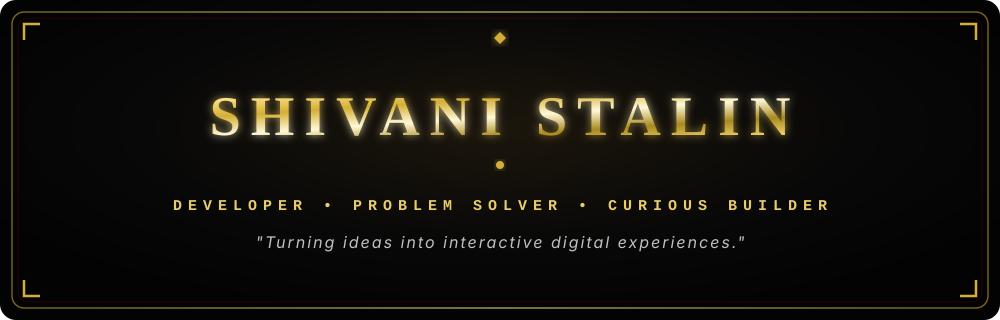
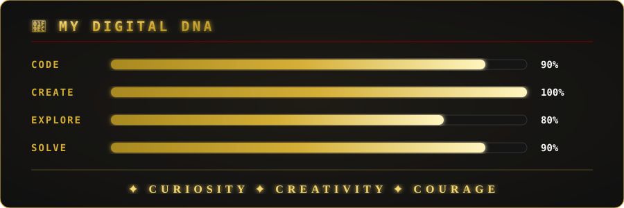
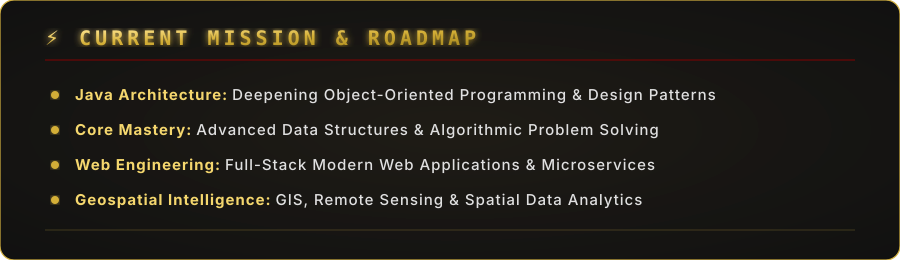
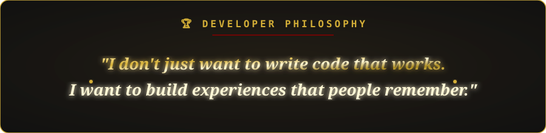

<div align="center">

  <!-- GLOWING GOLD HERO BANNER -->
  

  <br/><br/>

  <!-- DYNAMIC TYPING ANIMATION -->
  <a href="https://github.com/shivanistalin2006-dot">
    
  </a>

</div>

<br/>
<hr/>
<br/>

<!-- DEVELOPER BEHIND THE CODE -->
## ⚜️ THE DEVELOPER BEHIND THE CODE

```text
╔══════════════════════════════════════════════════════════════╗
║                                                              ║
║  🎓 B.Tech IT Student                                        ║
║  💻 Developer • Problem Solver • Curious Builder             ║
║  🚀 Turning ideas into interactive digital experiences       ║
║                                                              ║
║  "Great products start with curiosity and grow with code."   ║
║                                                              ║
╚══════════════════════════════════════════════════════════════╝
```

I am **Shivani Stalin**, a B.Tech Information Technology student and software developer focused on crafting digital products that combine clean programming principles, algorithmic logic, and captivating user experiences.

- ☕ **Core Engineering:** Java & Object-Oriented Architecture
- 🌐 **Modern Web:** JavaScript, HTML5/CSS3, React & Responsive UI
- 🧠 **Problem Solving:** Data Structures & Algorithms (DSA)
- 🎨 **Creative Tech:** Interactive Canvas, UI/UX & Web Animation
- 🗺️ **Geospatial Domain:** GIS, Spatial Analytics & Remote Sensing

<br/>

<!-- DIGITAL DNA -->
<div align="center">
  
</div>

<br/>

<!-- TECH ARSENAL -->
## ⚔️ TECH ARSENAL

### 💻 Languages
<p>
  
  
  
  
  
  
</p>

### 🛠️ Tools & Technologies
<p>
  
  
  
  
  
  
  
  
</p>

<br/>

<!-- FEATURED PROJECTS -->
## 🚀 FEATURED PROJECTS

<table>
  <tr>
    <td width="50%" valign="top">
      <h3 align="left">🎮 LuckyKit</h3>
      <p><b>A premium cyber arcade experience.</b></p>
      <p>A curated collection of interactive web games designed with a modern gaming aesthetic and fluid user interactions.</p>
      <p><b>Tech Stack:</b> <code>HTML</code> • <code>CSS</code> • <code>JavaScript</code> • <code>Bootstrap</code></p>
      <a href="https://github.com/shivanistalin2006-dot/LuckyKit"><b>Explore LuckyKit →</b></a>
    </td>
    <td width="50%" valign="top">
      <h3 align="left">📊 Heap Visualizer</h3>
      <p><b>Visualize. Understand. Master.</b></p>
      <p>An interactive visualization engine designed to make Heap data structures effortless to learn through step-by-step animations and real-time operations.</p>
      <p><b>Tech Stack:</b> <code>JavaScript</code> • <code>HTML</code> • <code>CSS</code> • <code>SVG</code></p>
      <a href="https://github.com/shivanistalin2006-dot"><b>Explore Heap Visualizer →</b></a>
    </td>
  </tr>
  <tr>
    <td width="50%" valign="top">
      <h3 align="left">📄 PaperVerse</h3>
      <p><b>A digital playground for paper.</b></p>
      <p>An experimental interactive Web application where users touch, fold, and manipulate digital paper dynamics via creative physics & canvas interactions.</p>
      <p><b>Tech Stack:</b> <code>JavaScript</code> • <code>Canvas API</code> • <code>PWA</code></p>
      <a href="https://github.com/shivanistalin2006-dot"><b>Explore PaperVerse →</b></a>
    </td>
    <td width="50%" valign="top">
      <h3 align="left">🌊 Watershed Intelligence</h3>
      <p><b>Monitoring landscapes through geospatial insights.</b></p>
      <p>A spatial analysis framework focusing on land use, drainage patterns, vegetation cover, soil moisture, water bodies, and environmental changes over time.</p>
      <p><b>Focus Areas:</b> <code>GIS</code> • <code>Remote Sensing</code> • <code>Spatial Analysis</code></p>
      <a href="https://github.com/shivanistalin2006-dot"><b>Explore Project →</b></a>
    </td>
  </tr>
</table>

<br/>

<!-- GITHUB COMMAND CENTER -->
## 📊 GITHUB COMMAND CENTER & GOLD STREAK

<div align="center">
  <!-- GOLD STREAK STATS -->
  
  
  <br/><br/>

  <!-- STATS & TOP LANGS -->
  
  &nbsp;
  
</div>

<br/>

<!-- GOLD CONTRIBUTION ACTIVITY -->
## 🔥 GOLD CONTRIBUTION ACTIVITY

<div align="center">
  
</div>

<br/>

<!-- CURRENT MISSION -->
<div align="center">
  
</div>

<br/>

<!-- DEVELOPER PHILOSOPHY -->
<div align="center">
  
</div>

<br/>

<!-- CONNECT WITH ME -->
## 🌐 CONNECT WITH ME

<div align="center">
  <a href="https://linkedin.com/in/shivanistalin">
    
  </a>
  &nbsp;
  <a href="https://shivanistalin2006-dot.github.io">
    
  </a>
  &nbsp;
  <a href="mailto:shivanistalin2006@gmail.com">
    
  </a>
  &nbsp;
  <a href="https://github.com/shivanistalin2006-dot">
    
  </a>
</div>

<br/>
<hr/>
<br/>

<!-- FINAL SIGNATURE -->
<div align="center">
  <p>⚜️ <b>BUILD • BREAK • LEARN • REPEAT</b> ⚜️</p>
  <p>🖤 <b>CODE WITH PURPOSE</b> &nbsp;•&nbsp; 🥇 <b>CREATE WITH COURAGE</b> &nbsp;•&nbsp; ❤️ <b>KEEP EVOLVING</b></p>
</div>
